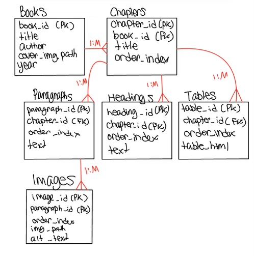

# 1. Overview of Data Model

The hierarchy :
Book → Chapters → Paragraphs/Headings/Images/Tables
Each book has multiple chapters. Each chapter contains paragraphs, headings, images, and tables. These elements are parsed from HTML and stored in the database in a structured format.

# 2. Data Model Entities

## 2.1 Book Table

The `Book` table represents a single book and contains data about the book, such as title, author, cover image path, and year of publication.

### Columns
- **`book_id` (Primary Key)**: Unique identifier for each book.
- **`title`**: Title of the book.
- **`author`**: Author of the book.
- **`cover_img_path`**: File path to the book’s cover image.
- **`year`**: Year the book was published.

### SQL for Book Table
```sql
CREATE TABLE books (
    book_id INTEGER PRIMARY KEY AUTOINCREMENT,
    title TEXT NOT NULL,
    author TEXT NOT NULL,
    cover_img_path TEXT,
    year INTEGER
);
```


## 2.2 Chapter Table

The `Chapter` table represents individual chapters or sections of a book.

### Columns
- **`chapter_id` (Primary Key)**: Unique identifier for each chapter.
- **`book_id` (Foreign Key)**: Links the chapter to its parent book.
- **`title`**: Title of the chapter.
- **`order_index`**: Order of the chapter within the book.

### SQL for Chapter Table
```sql
CREATE TABLE chapters (
    chapter_id INTEGER PRIMARY KEY AUTOINCREMENT,
    book_id INTEGER NOT NULL,
    title TEXT NOT NULL,
    order_index INTEGER NOT NULL,
    FOREIGN KEY (book_id) REFERENCES books (book_id) ON DELETE CASCADE
)
```


## 2.3 Paragraph Table

The `Paragraph` table stores the parsed text content from a chapter. Each paragraph is linked to a chapter.

### Columns
- **`paragraph_id` (Primary Key)**: Unique identifier for each paragraph.
- **`chapter_id` (Foreign Key)**: Links the paragraph to its parent chapter.
- **`order_index`**: The position of the paragraph within the chapter.
- **`text`**: The content of the paragraph.

### SQL for Paragraph Table
```sql
CREATE TABLE paragraphs (
    paragraph_id INTEGER PRIMARY KEY AUTOINCREMENT,
    chapter_id INTEGER NOT NULL,
    order_index INTEGER NOT NULL,
    text TEXT NOT NULL,
    FOREIGN KEY (chapter_id) REFERENCES chapters (chapter_id) ON DELETE CASCADE
);
```


## 2.4 Heading Table

The `Heading` table stores headings within a chapter.

### Columns
- **`heading_id` (Primary Key)**: Unique identifier for each heading.
- **`chapter_id` (Foreign Key)**: Links the heading to its parent chapter.
- **`order_index`**: The position of the heading within the chapter.
- **`text`**: The heading text.

### SQL for Heading Table
```sql
CREATE TABLE headings (
    heading_id INTEGER PRIMARY KEY AUTOINCREMENT,
    chapter_id INTEGER NOT NULL,
    order_index INTEGER NOT NULL,
    text TEXT NOT NULL,
    FOREIGN KEY (chapter_id) REFERENCES chapters (chapter_id) ON DELETE CASCADE
);
```


## 2.5 Image Table

The `Image` table stores metadata about images associated with a paragraph. Images are linked to paragraphs, not chapters.

### Columns
- **`image_id` (Primary Key)**: Unique identifier for each image.
- **`paragraph_id` (Foreign Key)**: Links the image to its parent paragraph.
- **`order_index`**: The position of the image within the paragraph.
- **`image_path`**: File path to the image file.
- **`alt_text`**: Alternative text for the image.

### SQL for Image Table
```sql
CREATE TABLE images (
    image_id INTEGER PRIMARY KEY AUTOINCREMENT,
    paragraph_id INTEGER NOT NULL,
    order_index INTEGER NOT NULL,
    image_path TEXT NOT NULL,
    alt_text TEXT,
    FOREIGN KEY (paragraph_id) REFERENCES paragraphs (paragraph_id) ON DELETE CASCADE
);
```


## 2.6 TableData Table

The `TableData` table stores tables in HTML format.

### Columns
- **`table_id` (Primary Key)**: Unique identifier for each table.
- **`chapter_id` (Foreign Key)**: Links the table to its parent chapter.
- **`order_index`**: The position of the table within the chapter.
- **`table_html`**: The serialized HTML content of the table.

### SQL for TableData Table
```sql
CREATE TABLE tables (
    table_id INTEGER PRIMARY KEY AUTOINCREMENT,
    chapter_id INTEGER NOT NULL,
    order_index INTEGER NOT NULL,
    table_html TEXT NOT NULL,
    FOREIGN KEY (chapter_id) REFERENCES chapters (chapter_id) ON DELETE CASCADE
);
```

# 3 Relationships Between Entities




# 4. SQL Queries for Data Retrieval

## 4.1 Retrieve All Books

```sql
SELECT * FROM books;
```

## 4.2 Retrieve Chapters for a Specific Book

```sql
SELECT * 
FROM chapters 
WHERE book_id = :bookId 
ORDER BY order_index;
```

## 4.3 Retrieve Content for a Specific Chapter

### Paragraphs
Retrieve all paragraphs for a specific chapter, ordered by their `order_index`.

```sql
SELECT * 
FROM paragraphs 
WHERE chapter_id = :chapterId 
ORDER BY order_index;
```

### Heading 
Retrieve all headings for a specific chapter, ordered by their order_index.

```sql
SELECT * 
FROM headings 
WHERE chapter_id = :chapterId 
ORDER BY order_index;
```

### Tables
Retrieve all tables for a specific chapter, ordered by their order_index.

```sql
SELECT * 
FROM tables 
WHERE chapter_id = :chapterId 
ORDER BY order_index;
```

## 4.4 Retrieve Images for a Specific Paragraph
```sql
SELECT * 
FROM images 
WHERE paragraph_id = :paragraphId 
ORDER BY order_index;

```
## 4.5  Retrieving a Chapter with All Content in Flow
```sql
SELECT 'paragraph' AS content_type, 
       p.order_index, 
       p.text AS content, 
       NULL AS image_path, 
       NULL AS table_html
FROM paragraphs p
WHERE p.chapter_id = :chapterId

UNION ALL

SELECT 'heading' AS content_type, 
       h.order_index, 
       h.text AS content, 
       NULL AS image_path, 
       NULL AS table_html
FROM headings h
WHERE h.chapter_id = :chapterId

UNION ALL

SELECT 'table' AS content_type, 
       t.order_index, 
       NULL AS content, 
       NULL AS image_path, 
       t.table_html AS table_html
FROM tables t
WHERE t.chapter_id = :chapterId

UNION ALL

SELECT 'image' AS content_type, 
       i.order_index, 
       NULL AS content, 
       i.image_path AS image_path, 
       NULL AS table_html
FROM images i
JOIN paragraphs p ON i.paragraph_id = p.paragraph_id
WHERE p.chapter_id = :chapterId

ORDER BY order_index;
```
# 5. Data Insertion

### Insert a Book
```sql
INSERT INTO books (title, author, cover_img_path, year) 
VALUES ('Data Structures', 'Ivana Zhekova, '/images/book1.jpg', 2022);
```
### Insert Chapters
```sql
INSERT INTO chapters (book_id, title, order_index) 
VALUES (1, 'Chapter 1: Introduction', 1),
       (1, 'Chapter 2: Sorting Algorithms', 2);
```
### Insert Paragraphs
```sql
INSERT INTO paragraphs (chapter_id, order_index, text) 
VALUES (1, 1, 'This is the first paragraph of Chapter 1.'),
       (1, 2, 'This is the second paragraph of Chapter 1.');
```
### Insert Images
```sql
INSERT INTO images (paragraph_id, order_index, image_path, alt_text) 
VALUES (1, 1, '/images/image1.jpg', 'An example image.');
```
### Insert Headings
```sql
INSERT INTO headings (chapter_id, order_index, text) 
VALUES (1, 1, 'Introduction to Algorithms');
```
### Insert Tables
```sql
INSERT INTO tables (chapter_id, order_index, table_html) 
VALUES (1, 1, '<table><tr><td>Data</td></tr></table>');
```

# 6. Rationale

- **Natural Structure**: The model reflects the book's natural hierarchy: `Books → Chapters → Content(s)`. This structure aligns with how books are organized in the real world.
- **Content Flexibility**: By using separate tables for paragraphs, images, headings, and tables, the model allows for easy extension or modifications to any content type without affecting the others.
- **Efficient Retrieval**: Queries are designed to retrieve content efficiently and in the correct order, ensuring smooth rendering of the book's structure.
- **Scalability**: The model supports multiple books and chapters, making it adaptable for larger collections and future growth.

# 7. Notes on the model 
The data model is designed to mirror the natural structure of a book, making it easy to parse, store, and retrieve content in a clear and organized way. At the top level, we have the Book table, which stores data about each book, such as its title, author, cover image, and publication year. Each book is linked to multiple Chapters, which are ordered and store the titles of the chapters within the book.
Chapters then break down into lower content elements like Paragraphs, Headings, Images, and Tables, each of which is stored in its own table. Paragraphs store the main text content, images are linked to specific paragraphs and include metadata like file paths and alternative text for accessibility. Headings provide a way to structure the content visually, and tables store serialized HTML for data. The model ensures that everything is connected together through unique identifiers and foreign keys, while order_index columns maintain the natural flow of content of the book.

# 8. Testing Strategy

## 8.1 Local/Functional Tests

A local or functional test is a unit test that validates a specific logic of the app to ensure it the logic is correct. An example would be ensuring that a function of the viewmodel updates a state correctly. Unit tests do not call the Android API making them very fast and low overhead.

For our app, here are aspects to test:
- Check that the BookReadingAppViewModel's toggleReadingMode function makes its isReadingMode property change to true if it's initially false.
- Check that the BookReadingAppViewModel's toggleReadingMode function makes its isReadingMode property change to false if it's initially true.
- Check that the BookReadingAppViewModel's updateQuery function updates its query property to the same value passed in to the function.
- Check that the BookReadingAppViewModel's setupDownload function adds to its directoryContents property the name of the path (string) passed to it and with the .zip remove from its name.
- Check that the BookReadingAppViewModel's confirmDeletion function removes the path (string) passed to it from its directoryContents property. 

## 8.2 Instrumentation Tests

An instrumentation test is a test that validates the visuals of an app. Such tests calls the Android API making them very slow. An example of an instrumentation test is a test that ensures clicking on the Home icon of the navigation bar will successfully navigate to the Home page. 

For our app, here are aspects to test:
- Check that there is a bottom navigation bar in compact.
- Check that there is a rail navigation in medium.
- Check that there is a drawer navigation in expanded.
- Check that each navigation type (bottom, rail, drawer) contain the following three icons: Home, Menu, and Search.
- Check that each navigation type's Home icon's goes to the Home page upon click.
- Check that each navigation type's Library icon's goes to the Library page upon click.
- Check that each navigation type's Search icon's goes to the Search page upon click.
- Check that the home page has a title.
- Check that the home page has a button that goes to the Library page upon click.
- Check that the home page has a quote.
- Check that the library page has a title.
- Check that the library page has the same amount of books as the number of items in the BookReadingAppViewModel's directoryContents property.
- Check that any book on the library page goes to the Table of Content page upon click.
- Check that the Table of Content page has a title.
- Check that the Table of Content page displays a list of chapters that are each clickable.
- Check that the Table of Content page has a switch.
- Check that the Table of Content's switch upon turning on removes the navigation.
- Check that the Table of Content's switch upon turning off displays the navigation.
- Check that any of the chapters listed in the Table of Content goes to the Reading page upon click.
- Check that the Reading page has a title.
- Check that the Reading page displays some text.
- Check that the Reading page has a switch.
- Check that the Reading page's switch upon turning on removes the navigation.
- Check that the Reading page's switch upon turning off displays the navigation.
- Check that the Search page has a title.
- Check that the Search page has a search bar.
- Check that the Search page's search bar can receive an input and this input is displayed in the search bar.

## 8.3 Running the Test Coverage Tool

The test coverage tool is a tool that tells you the percentage and areas of your code that is covered by tests. A 100% covered code doesn't mean that all possible tests are created. A not 100% covered code doesn't mean that there are missing tests. The tool is great at pointing out what part of your tests are not covered and therefore can make you realize the possibility of missing tests that you forgot about.

## 8.4 Steps to Writing Good Unit Tests

The following outlines the steps to take when writing unit tests that thoroughly test the entirety of an app.

1. Write down on a paper all the sorts of tests you wanna write. This includes high level expectations from your app such as having an app with a homepage. 
2. As you start coding, write tests for every new feature you just completed. Or at least write them down on a paper for later or on the test files as comments. When just completing a feature, it is easier to think about all the scenarios to test than thinking about them at the end of a project when the feature has been completed a few weeks ago. Plus, you're more likely to think about edge cases in the moment of coding a feature. Ensure you cover both unit tests and instrumentation tests. If your app handles multiple screen sizes, it is also a good idea to write instrumentation tests for each screen size even if it gets repetitive.
3. For each test, upon writing them, run them right away and fix the bug(s) if the test don't pass. This adds to the advantage of writing tests as you code, because you can spot mistakes early on.
4. When coding is done, test the app manually as if you're the user. Fix anything that needs to be fixed and add more tests or correct existing tests if needed after fixing code. Once satisfied, run all the tests and ensure they all pass. Otherwise, fix the code. 
5. Once manual testing and automated testing passes, run the test coverage tool to see if there are any areas of code missed by automated tests. If there are, analyze them to see if they require to be tested and write more tests accordingly. Navigation is a very important part of an app, so pay extra attention to testing your app's navigation whether it's through clicking a button or pressing the back button.